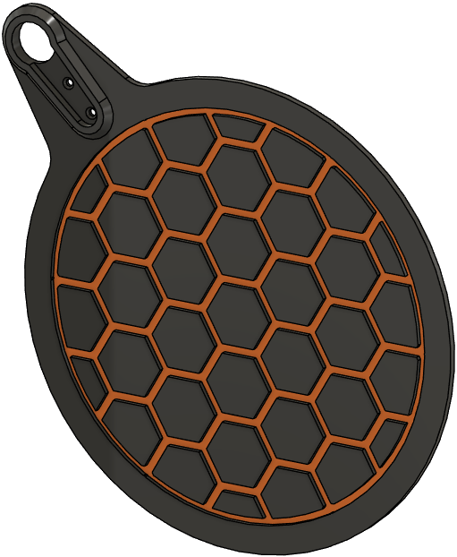

# SmokeMATE 

## PARTS

1. Airflow Damper
 

2. Blower Housing

3. Blower Housing Screw Access Plug

4. Blower Interface Adapter

5. Control Knob

6. Display Housing

7. Electronics Housing

8. Electronics Lid

9. Electronics Mounting Panel

10. Encoder Access Plug

11. Supports

12. Blower Driver Holders

13. Thermometer Labels

